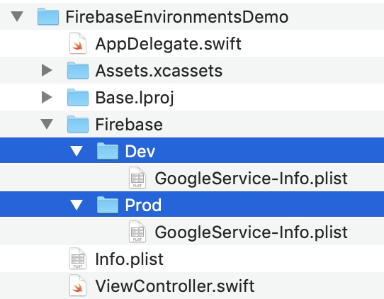
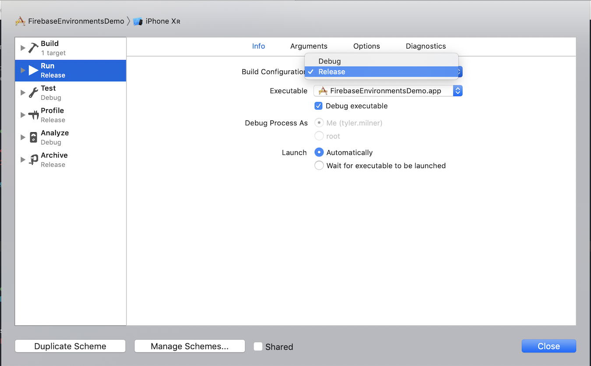

# FirebaseEnvironmentsDemo

An Xcode project showing how to swap out your `GoogleService-Info.plist` based on build configuration to enable you to keep separate development and production Firebase environments.

## Getting Started

At a high level, the main idea is to add a "run script" build phase to your target that selectively copies the appropriate `GoogleService-Info.plist` based on the current build configuration.

### Areas of Interest

#### `Firebase/Dev` and `Firebase/Prod` folders.

These contain the `GoogleService-Info.plist` for the Firebase development and production environments. Note that the names of these files are kept as their defaults and they are *not* part of the app target.




#### "Setup Firebase Environment GoogleService-Info.plist" Run Script Build Phase

This [shell script](https://gist.github.com/tylermilner/f8e9121d62c890cb707bc1810a7d57d9), part of the target's *Build Phases*, is where the appropriate `GoogleService-Info.plist` is copied based on build configuration.


### Prerequisites

To build the sample app, you'll need CocoaPods. CocoaPods is a dependency manager for Cocoa projects. You can install it with the following command:

```
gem install cocoapods
```

### Project Setup

Clone or download the sample project and then run the following command to let CocoaPods install the Firebase SDK and setup the Xcode workspace:

```
pod install
```

## Seeing the Script in Action

### Run the App

The sample app is configured to display the contents of the `GOOGLE_APP_ID` key in the `GoogleService-Info.plist`. Open `FirebaseEnvironmentsDemo.xcworkspace` and hit `CMD` + `R` to run the sample app. By default, the app will build and run using the `Debug` build configuration and the contents on the screen will reflect the "dev" App ID.


Next, change the Build Configuration used for the scheme's "Run" action from "Debug" to "Release".



Hit `CMD` + `R` to run the app again. Notice the "prod" App ID is now displayed.


### Verifying Manually

You can also manually inspect the contents of the `FirebaseEnvironmentsDemo.app` build product to check the values in the bundled `GoogleService-Info.plist`. Initially, the values should match those of the `GoogleService-Info.plist` inside of the `Firebase/Dev` folder in the Xcode project.


After switching the scheme to "Release" and building the project again, you should see that the `GoogleService-Info.plist` contained in `FirebaseEnvironmentsDemo.app` corresponds to the `GoogleService-Info.plist` in the `Firebase/Prod` folder.

## Built With

At the time of writing, the sample project uses the following technologies:

* Xcode 10.2.1
* CocoaPods 1.7.3
* Firebase iOS SDK 6.3.0

## License

This project is licensed under the MIT License - see the [LICENSE](LICENSE) file for details

## Acknowledgments

* [cohenadair's firebase-sandbox gist](https://gist.github.com/cohenadair/3a2aff5084603bfa65824f09cf74206e)
    * This has some great info, but suggests manually configuring the Firebase SDK instance at application launch to use the appropriate `GoogleService-Info.plist`. I noticed that the [Firebase documentation](https://firebase.google.com/docs/configure/#support_multiple_environments_in_your_ios_application) acknowledges this approach, but doesn't recommend it in [certain scenarios](https://firebase.google.com/docs/configure/#reliable-analytics). This is my inspiration for creating this guide.
